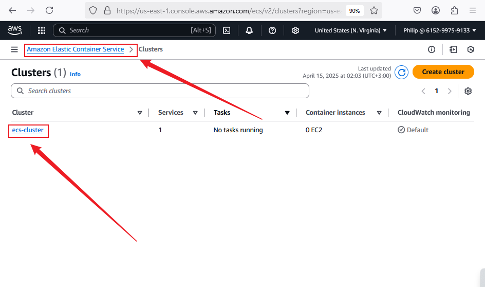
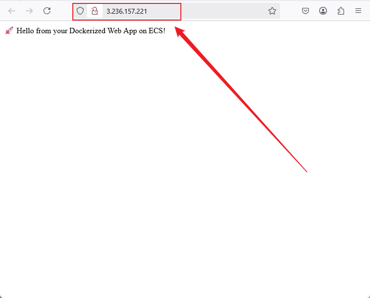

# 🛠️ Hosting a Dynamic Web App on AWS with Terraform Module, Docker, Amazon ECR, and ECS

## 📌 Project Overview

This project demonstrates how to host a dynamic web application on Amazon ECS using modular Terraform configurations and Docker. The goal is to create a reusable, clean, and production-ready infrastructure setup using ECR for image storage and ECS Fargate for container orchestration.

## 🎯 Objectives

1. **Terraform Module Creation** – Build reusable modules for infrastructure components.
2. **Dockerization** – Containerize a web app with Docker.
3. **Amazon ECR Configuration** – Push Docker images to ECR via Terraform.
4. **Amazon ECS Deployment** – Deploy the Dockerized app on ECS with Fargate.

## 🧱 Project Setup

### 📁 Step 1: Create Project Directory

```bash
mkdir terraform-ecs-webapp
cd terraform-ecs-webapp
```

Inside this folder, create the following subdirectories:

```bash
mkdir app modules
mkdir modules/ecr modules/ecs modules/network
```

Your directory structure now looks like this:

```
terraform-ecs-webapp/
│
├── app/                          # Dynamic web app source code
├── modules/
│   ├── ecr/                      # Terraform module for Amazon ECR
│   ├── ecs/                      # Terraform module for ECS cluster and service
│   └── network/                  # Terraform module for VPC, subnets, security group
│
├── main.tf                       # Root Terraform config
├── variables.tf
├── outputs.tf
├── terraform.tfvars
└── README.md                     # Project documentation
```

> ✅ Let’s now begin with **Task 1** – building and Dockerizing your app.

## ✅ Task 1: Dockerization of Web App

### 📝 Step 1: Build a Dynamic Web App (Node.js)

Navigate into the `app` folder:

```bash
cd app
```

Create the following files:

```bash
touch index.js package.json
```

#### `index.js`

```js
const express = require('express');
const app = express();
const PORT = process.env.PORT || 3000;

app.get('/', (req, res) => {
  res.send('🚀 Hello from your Dockerized Web App on ECS!');
});

app.listen(PORT, () => {
  console.log(`App running on http://localhost:${PORT}`);
});
```

#### `package.json`

```json
{
  "name": "ecs-docker-app",
  "version": "1.0.0",
  "main": "index.js",
  "scripts": {
    "start": "node index.js"
  },
  "dependencies": {
    "express": "^4.18.2"
  }
}
```

Install the dependencies:

```bash
npm install
```
### 📦 Step 2: Create Dockerfile

Still inside the `app/` folder, create a `Dockerfile`:

```bash
touch Dockerfile
```

#### `Dockerfile`

```Dockerfile
# Use an official Node.js runtime as a base image
FROM node:18-alpine

# Set working directory
WORKDIR /usr/src/app

# Copy package files and install dependencies
COPY package*.json ./
RUN npm install

# Copy the rest of the application
COPY . .

# Expose port
EXPOSE 3000

# Run the app
CMD ["npm", "start"]
```

### 🧪 Step 3: Test Docker Image Locally

Build the Docker image:

```bash
docker build -t ecs-webapp .
```

Run the container locally:

```bash
docker run -p 3000:3000 ecs-webapp
```

Open your browser and go to:

```
http://localhost:3000
```

You should see:

> 🚀 Hello from your Dockerized Web App on ECS!


## ✅ Task 2: Terraform Module for Amazon ECR

### 📁 Step 1: Ensure Directory Structure

If you haven't already, create the module directory:

```bash
mkdir -p terraform-ecs-webapp/modules/ecr
cd terraform-ecs-webapp/modules/ecr
```

This is where your ECR module files will live.

### 📄 Step 2: Create Module Files

Create the required Terraform configuration files:

```bash
touch main.tf variables.tf outputs.tf
```

---

### 🧱 `main.tf` – Create ECR Repository

```hcl
resource "aws_ecr_repository" "this" {
  name                 = var.repository_name
  image_tag_mutability = "MUTABLE"

  image_scanning_configuration {
    scan_on_push = true
  }

  tags = {
    Name        = var.repository_name
    Environment = var.environment
  }
}
```

### 🔧 `variables.tf` – Input Variables

```hcl
variable "repository_name" {
  description = "The name of the ECR repository"
  type        = string
}

variable "environment" {
  description = "Deployment environment"
  type        = string
  default     = "dev"
}
```

### 📤 `outputs.tf` – Export ECR Info

```hcl
output "repository_url" {
  description = "The URL of the ECR repository"
  value       = aws_ecr_repository.this.repository_url
}

output "repository_name" {
  description = "Name of the created ECR repository"
  value       = aws_ecr_repository.this.name
}
```

### 📁 Step 3: Call ECR Module in Root Config

Go to your project root (e.g., `terraform-ecs-webapp`) and update your root Terraform files.

#### 🔧 `main.tf` in root:

```hcl
module "ecr" {
  source          = "./modules/ecr"
  repository_name = "ecs-webapp-repo"
  environment     = "dev"
}
```

> 💡 This configuration will automatically create an ECR repository named `ecs-webapp-repo`.

### ▶️ Step 4: Initialize and Apply Terraform

**Why now?**  
We must **apply the ECR module** before creating our Terraform backend (S3) because the ECR repository is needed for the next task — pushing the Docker image.

From the project root:

```bash
terraform init
terraform apply
```

Confirm the creation of the ECR repository.


## ✅ Task 3: Terraform Module for ECS

### 📁 Step 1: Create the ECS Module Directory

From your project root, run:

```bash
mkdir -p terraform-ecs-webapp/modules/ecs
cd terraform-ecs-webapp/modules/ecs
touch main.tf variables.tf outputs.tf
```

### 🧱 `main.tf` – ECS Cluster & Service

This example creates an ECS cluster, task definition, and service using Fargate:

```hcl
resource "aws_ecs_cluster" "this" {
  name = var.cluster_name
}

resource "aws_ecs_task_definition" "this" {
  family                   = var.task_family
  requires_compatibilities = ["FARGATE"]
  network_mode             = "awsvpc"
  cpu                      = var.cpu
  memory                   = var.memory
  execution_role_arn       = var.execution_role_arn
  task_role_arn            = var.task_role_arn

  container_definitions = jsonencode([
    {
      name      = var.container_name
      image     = var.container_image
      essential = true
      portMappings = [
        {
          containerPort = var.container_port
          hostPort      = var.container_port
          protocol      = "tcp"
        }
      ]
    }
  ])
}

resource "aws_ecs_service" "this" {
  name            = var.service_name
  cluster         = aws_ecs_cluster.this.id
  launch_type     = "FARGATE"
  task_definition = aws_ecs_task_definition.this.arn
  desired_count   = var.desired_count

  network_configuration {
    subnets         = var.subnet_ids
    security_groups = [var.security_group_id]
    assign_public_ip = true
  }
}
```

### 🔧 `variables.tf` – Define Inputs

```hcl
variable "cluster_name" {}
variable "task_family" {}
variable "cpu" {}
variable "memory" {}
variable "execution_role_arn" {}
variable "task_role_arn" {}
variable "container_name" {}
variable "container_image" {}
variable "container_port" {}
variable "service_name" {}
variable "desired_count" {}
variable "subnet_ids" {
  type = list(string)
}
variable "security_group_id" {}
```

### 📤 `outputs.tf` – Expose Key Values

```hcl
output "cluster_id" {
  value = aws_ecs_cluster.this.id
}

output "service_name" {
  value = aws_ecs_service.this.name
}
```

### 📁 Step 2: Terraform Module for Network

If you haven't already, create the module directory:

```bash
mkdir -p terraform-ecs-webapp/modules/network
cd terraform-ecs-webapp/modules/network
```

This is where your Network module files will live.

### 📄 Step 2: Create Module Files

Create the required Terraform configuration files:

```bash
touch main.tf variables.tf outputs.tf
```

### 1. **`network/main.tf`**

This file contains the actual Terraform configuration for provisioning the network resources.

```hcl
# Create VPC
resource "aws_vpc" "main_vpc" {
  cidr_block = "10.0.0.0/16"
  enable_dns_support = true
  enable_dns_hostnames = true
  tags = {
    Name = "main-vpc"
  }
}

# Create Public Subnet 1
resource "aws_subnet" "subnet_1" {
  vpc_id                  = aws_vpc.main_vpc.id
  cidr_block              = "10.0.1.0/24"
  availability_zone       = "us-east-1a"
  map_public_ip_on_launch = true
  tags = {
    Name = "subnet-1"
  }
}

# Create Public Subnet 2
resource "aws_subnet" "subnet_2" {
  vpc_id                  = aws_vpc.main_vpc.id
  cidr_block              = "10.0.2.0/24"
  availability_zone       = "us-east-1b"
  map_public_ip_on_launch = true
  tags = {
    Name = "subnet-2"
  }
}

# Create Security Group for ECS
resource "aws_security_group" "ecs_sg" {
  vpc_id = aws_vpc.main_vpc.id

  ingress {
    from_port   = 80
    to_port     = 80
    protocol    = "tcp"
    cidr_blocks = ["0.0.0.0/0"]
  }

  egress {
    from_port   = 0
    to_port     = 0
    protocol    = "-1"
    cidr_blocks = ["0.0.0.0/0"]
  }

  tags = {
    Name = "ecs-security-group"
  }
}
```

### 2. **`network/variables.tf`**

This file defines all the variables that make the module flexible. It allows you to pass custom values for VPC CIDR blocks, subnet CIDRs, availability zones, and so on.

```hcl
variable "vpc_cidr_block" {
  description = "The CIDR block for the VPC"
  type        = string
  default     = "10.0.0.0/16"
}

variable "subnet_1_cidr" {
  description = "The CIDR block for the first subnet"
  type        = string
  default     = "10.0.1.0/24"
}

variable "subnet_2_cidr" {
  description = "The CIDR block for the second subnet"
  type        = string
  default     = "10.0.2.0/24"
}

variable "availability_zone_1" {
  description = "The first availability zone"
  type        = string
  default     = "us-east-1a"
}

variable "availability_zone_2" {
  description = "The second availability zone"
  type        = string
  default     = "us-east-1b"
}
```

### 3. **`network/outputs.tf`**

This file defines the outputs of the module, which are the VPC ID, subnet IDs, and security group ID. These are useful for passing information to other modules like ECS.

```hcl
output "vpc_id" {
  value = aws_vpc.main_vpc.id
}

output "subnet_ids" {
  value = [aws_subnet.subnet_1.id, aws_subnet.subnet_2.id]
}

output "security_group_id" {
  value = aws_security_group.ecs_sg.id
}
```

### 4. **Usage in Root `main.tf`**

Now, when you call this `network` module in your root `main.tf`, it will pass variables for the CIDR blocks and availability zones and use the outputs to pass the network-related information to other modules like ECS.

```hcl
module "network" {
  source = "./modules/network"

  vpc_cidr_block     = "10.0.0.0/16"
  subnet_1_cidr      = "10.0.1.0/24"
  subnet_2_cidr      = "10.0.2.0/24"
  availability_zone_1 = "us-east-1a"
  availability_zone_2 = "us-east-1b"
}

module "ecs" {
  source              = "./modules/ecs"
  cluster_name        = "ecs-cluster"
  task_family         = "ecs-webapp-task"
  cpu                 = "256"
  memory              = "512"
  execution_role_arn  = "arn:aws:iam::615299759133:role/ecs-task-execution-role"
  task_role_arn       = "arn:aws:iam::615299759133:role/ecs-task-role"
  container_name      = "webapp"
  container_image     = "615299759133.dkr.ecr.us-east-1.amazonaws.com/ecs-webapp-repo:latest"
  container_port      = 80
  service_name        = "webapp-service"
  desired_count       = 1
  subnet_ids          = module.network.subnet_ids  # Pass the subnet IDs from the network module
  security_group_id   = module.network.security_group_id  # Pass the security group ID from the network module
}
```

### ▶️ Step 3: Run Terraform to Deploy ECS

From the root:

```bash
terraform apply
```

Wait for the ECS service to be deployed.


##  Task 4: Main Terraform Configuration

### 🎯 Objective

The goal of this task is to build the **main Terraform configuration** (`main.tf`) that ties all infrastructure modules together. This includes:
- **Elastic Container Registry (ECR)** for storing Docker images.
- **Amazon ECS** for container orchestration and service deployment.
- **Networking resources** (VPC, subnets, security groups) necessary for ECS to operate securely and reliably.

### 📁 File: `main.tf`

This file is located in the **root** of the project and references the reusable modules for **ECR**, **ECS**, and **Network**.

### ✅ Modules Integrated

#### 🗂️ `ECR Module`
Provisions a private ECR repository to host the Dockerized web application.

```hcl
module "ecr" {
  source          = "./modules/ecr"
  repository_name = "ecs-webapp-repo"
  environment     = "dev"
}
```

#### 🌐 `Network Module`
Provisions the required network infrastructure: a VPC, two subnets across availability zones, and a security group.

```hcl
module "network" {
  source              = "./modules/network"
  vpc_cidr_block      = "10.0.0.0/16"
  subnet_1_cidr       = "10.0.1.0/24"
  subnet_2_cidr       = "10.0.2.0/24"
  availability_zone_1 = "us-east-1a"
  availability_zone_2 = "us-east-1b"
}
```
#### 📦 `ECS Module`
Deploys the Dockerized application to ECS, using the infrastructure created above.

```hcl
module "ecs" {
  source              = "./modules/ecs"
  cluster_name        = var.cluster_name
  task_family         = var.task_family
  cpu                 = var.cpu
  memory              = var.memory
  container_name      = var.container_name
  container_port      = var.container_port
  service_name        = var.service_name
  desired_count       = var.desired_count
  execution_role_arn  = var.execution_role_arn
  task_role_arn       = var.task_role_arn
  container_image     = var.container_image
  subnet_ids          = module.network.subnet_ids
  security_group_id   = module.network.security_group_id
}
```
### 📌 Notes

- **Variable values** such as `execution_role_arn`, `task_role_arn`, and `container_image` are expected to be provided via `terraform.tfvars` or CLI input.
- Output values from the **network module** are dynamically passed to the **ECS module** to ensure connectivity and security.

###  Next Steps

To apply this configuration:

```bash
terraform init
terraform plan
terraform apply
```

### Task 5: Deployment

For **Task 5**, we'll break it down step by step, as described. This involves:

1. **Building the Docker image** of your web app.
2. **Pushing the Docker image** to the Amazon ECR repository that was created by Terraform.
3. **Running Terraform** commands to deploy the ECS cluster and web app.
4. **Accessing the web app** through the public IP or DNS of the ECS service.


### 1. **Build the Docker Image of Your Web App**

If your web app is ready for Dockerization, the first step is to create a Docker image. Ensure you have a `Dockerfile` in your project directory.

**Steps**:
- Navigate to your project directory where the `Dockerfile` is located.
- Run the following command to build the Docker image:

```bash
docker build -t ecs-webapp-repo:latest .
```
This will build the Docker image tagged as `latest` for your web app.

### 2. **Push the Docker Image to the Amazon ECR Repository**

Before pushing to Amazon ECR, you'll need to authenticate Docker to your Amazon ECR registry and push the image.

#### Step-by-Step Process:
- **Authenticate Docker to ECR**:

Run the following command to authenticate Docker to Amazon ECR (replace `us-east-1` with your region if different):

```bash
aws ecr get-login-password --region us-east-1 | docker login --username AWS --password-stdin 615299759133.dkr.ecr.us-east-1.amazonaws.com
```

- **Tag the Docker Image**:

Tag the Docker image so it matches the Amazon ECR repository:

```bash
docker tag ecs-webapp-repo:latest 615299759133.dkr.ecr.us-east-1.amazonaws.com/ecs-webapp-repo:latest
```

- **Push the Image to ECR**:

Now push the image to the ECR repository you created with Terraform:

```bash
docker push 615299759133.dkr.ecr.us-east-1.amazonaws.com/ecs-webapp-repo:latest
```

This will upload your Docker image to the ECR repository. 

### 3. **Run `terraform init` and `terraform apply` to Deploy the ECS Cluster and Web App**

Now that the Docker image is pushed to ECR, it's time to deploy the ECS cluster and web app using Terraform.

- **Initialize Terraform**:

This command initializes your Terraform configuration and downloads necessary providers:

```bash
terraform init
```

- **Apply Terraform Configuration**:

To deploy the ECS resources (VPC, subnets, ECS services, etc.), run:

```bash
terraform apply
```

Terraform will show you an execution plan. Type `yes` to proceed with applying the plan.

Once the `terraform apply` command is successful, Terraform will provision the necessary ECS infrastructure and deploy the web app to ECS.

### 4. **Access the Web App Through the Public IP or DNS of the ECS Service**

After the ECS service is successfully deployed, you can access the web app.

- In the **AWS Management Console**, navigate to **ECS > Clusters** and find the **ECS cluster** you just created.
- Click on the **Services** tab inside your cluster and find your web app's ECS service.
- Under the **Load balancer** section, you will find the **DNS name** or **public IP** of your web app.

**ECS Service Public IP **
```bash
http://3.236.157.221
```
You can now access your deployed web app via the provided URL.
**Screenshot: ECS Service Public IP**


### ✅ **Task 6: Document Observations & Challenges**

Create a section in your README.md or a separate markdown file called `observations.md`. Here's a template to guide you:

#### **Observations**

* ECS with Fargate makes container deployment serverless and scalable.
* Using Terraform modules improved reusability and organization.
* ECS services automatically handled networking with `assign_public_ip`.
* Application was accessible after applying `terraform apply` successfully.
* Security groups with ports `80` and `3000` helped during testing stages.

#### **Challenges Faced**

* Needed to ensure the Docker container exposes the correct port (`80`).
* ECS TaskDefinition required matching the container port with Terraform variables.
* Deleted old ECR images manually to avoid confusion with previous builds.
* Remembered to run `docker build`, `tag`, and `push` **before** running `terraform apply`.
* Ensured VPC, subnets, and route tables were correctly associated or the service wouldn’t deploy.

### ✅ **Task 7: Git Version Control**

Here’s what to do:

1. **Initialize Git Repo (if not already)**:

   ```bash
   git init
   ```

2. **Add and Commit Your Files**:

   ```bash
   git add .
   git commit -m "Initial commit - Dockerized ECS app with Terraform"
   ```

3. **Create .gitignore** (if not already):
   Example:

   ```
   node_modules/
   .terraform/
   terraform.tfstate
   terraform.tfstate.*
   .env
   ```

4. **Push to GitHub**:

   ```bash
   git remote add origin https://github.com/your-username/your-repo-name.git
   git branch -M main
   git push -u origin main
   ```
